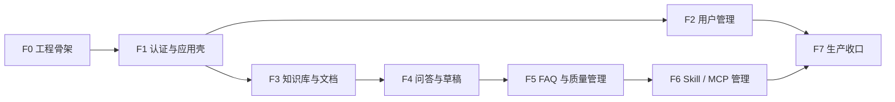

# 06. 前端实施总控文档

版本：v0.2  
日期：2026-07-10  
状态：Draft  
作用：前端计划唯一入口；只做导航、范围控制、依赖管理和进度汇总

---

## 1. 使用规则：防止注意力跑偏

每次前端任务只允许使用以下上下文：

1. 本总控文档；
2. 当前任务对应的一份子计划；
3. 子计划明确列出的后端文件或 API 文档；
4. 当前任务直接涉及的源码和测试。

执行纪律：

- 一次只激活一个 Frontend Phase；
- 不顺手实现其他页面、组件或后端接口；
- 子计划未列出的需求进入 Backlog，不在当前任务扩展；
- API 未达到“就绪”条件时，只允许契约设计或 MSW 测试，不得伪装成真实联调完成；
- 通用抽象至少出现两处真实复用后再提取；
- 每个任务结束时只更新当前子计划和本总控文档的状态；
- 不修改 `docs/01`～`docs/05`，除非另有明确任务；
- 不因前端需要擅自修改后端，后端缺口单独登记。

---

## 2. 当前项目事实

当前仓库没有前端源码。后端当前实际挂载：

| 能力 | 接口 | 状态 |
|---|---|---|
| 健康检查 | `GET /health` | 已实现 |
| 登录 | `POST /api/auth/login` | 已实现 |
| 当前用户 | `GET /api/auth/me` | 已实现 |
| 用户列表 | `GET /api/users` | 已实现，仅 `sys_admin` |
| 创建用户 | `POST /api/users` | 已实现，仅 `sys_admin` |
| 修改用户角色 | `PUT /api/users/{user_id}/roles` | 已实现，仅 `sys_admin` |
| 知识库、聊天、草稿、FAQ、Skill、MCP、审计、Eval | `docs/03-api-design.md` 中对应接口 | 设计态 |

任何子计划都不得把“设计态”写成“已实现”。

---

## 3. 文档地图

| 编号 | 文档 | 只解决的问题 | 何时读取 |
|---|---|---|---|
| 01 | [范围与产品边界](frontend/01-scope-and-boundaries.md) | 做什么、不做什么、角色和核心闭环 | 立项、需求判断 |
| 02 | [技术架构与目录](frontend/02-technical-architecture.md) | 技术栈、目录、部署和代码边界 | F0、架构调整 |
| 03 | [UI/UX 设计合同](frontend/03-ui-ux-design-contract.md) | 视觉令牌、交互、文案、可访问性 | 开发页面或组件 |
| 04 | [路由、认证与权限](frontend/04-routing-auth-permissions.md) | 路由、会话恢复、角色和资源权限 | F1、权限相关任务 |
| 05 | [API、状态与错误](frontend/05-api-state-error-contracts.md) | API Client、Query、响应兼容、错误模型 | 任意接口联调 |
| 06 | [基础功能计划](frontend/06-foundation-features.md) | 登录、AppShell、用户管理 | F1～F2 |
| 07 | [核心业务功能计划](frontend/07-core-business-features.md) | 知识库、文档、问答、草稿 | F3～F4 |
| 08 | [管理与质量功能计划](frontend/08-admin-quality-features.md) | FAQ、Skill、MCP、审计、Eval | F5～F6 |
| 09 | [测试、安全与质量门禁](frontend/09-testing-security-quality.md) | 测试、安全、性能、生产检查 | 每阶段验收、F7 |
| 10 | [交付路线图](frontend/10-delivery-roadmap.md) | F0～F7 顺序、依赖、完成定义 | 排期、推进、复盘 |

如果一个任务同时需要三份以上子计划，应先拆任务，而不是继续增加上下文。

---

## 4. 全局锁定决策

以下决策在没有独立架构变更任务时视为锁定：

| 项目 | 决策 |
|---|---|
| 前端形态 | 独立 SPA，不做 SSR |
| 基础栈 | React + TypeScript + Vite |
| 路由 | React Router |
| 服务端状态 | TanStack Query |
| 表单 | React Hook Form + Zod |
| 样式 | Tailwind CSS + CSS Variables |
| 基础组件 | 本地 shadcn/ui 风格组件 + Radix primitives |
| API Mock | MSW，仅开发和测试使用 |
| E2E | Playwright |
| 全局状态 | 只保留 Auth；不默认引入 Redux |
| Token 过渡方案 | 内存 + `sessionStorage`，后续可切 HttpOnly Refresh Token |
| 权限边界 | 前端只做体验门禁，后端鉴权为最终安全边界 |
| 首版 Chat | 普通 HTTP，不预设 SSE |

版本号由真正初始化工程时锁定并提交 lockfile，本设计不固定易过期的具体版本号。

---

## 5. 实施依赖图



额外门禁：

- F1、F2 可对接当前后端；
- F3～F6 必须等待相应 Router 挂载、OpenAPI 稳定和后端集成测试通过；
- F7 只能在所有计划投入生产的模块完成真实联调后开始。

---

## 6. API 就绪状态

统一状态：

```text
implemented   Router 已挂载并完成真实联调
contract-only 只有设计文档或 OpenAPI 草案
mock-only     仅 MSW 可用
blocked       契约或依赖存在阻塞
production-off 已实现但生产入口关闭
```

接口从 `contract-only` 转为 `implemented` 必须满足：

1. Router 已挂载到 FastAPI 应用；
2. OpenAPI 可见且 Schema 稳定；
3. 认证、权限和主要错误有测试；
4. 真实数据库路径通过集成测试；
5. 前端至少完成一次真实联调；
6. 不依赖开发者本地手工数据才能运行。

---

## 7. 阶段状态总表

| Phase | 范围 | 当前状态 | 后端依赖 |
|---|---|---|---|
| F0 | 工程、测试、API 基础设施 | 已完成 | 无 |
| F1 | 登录、会话、AppShell、路由守卫 | 未开始 | 已满足 |
| F2 | 用户列表、创建用户、修改角色 | 未开始 | 已满足 |
| F3 | 知识库、文档上传、索引状态 | 阻塞 | KB/Document API |
| F4 | 问答、引用、反馈、草稿 | 阻塞 | Chat/Draft API |
| F5 | FAQ、审计、评估 | 阻塞 | FAQ/Audit/Eval API |
| F6 | Skill、Tool、MCP | 阻塞 | Skill/Tool/MCP API |
| F7 | 可访问性、性能、部署、全量 E2E | 阻塞 | F1～F6 目标范围完成 |

状态只能使用：`未开始 / 进行中 / 阻塞 / 已完成 / 暂不投入生产`。

---

## 8. 每个任务的固定模板

开始前：

```text
当前 Phase：
当前子计划：
允许修改的文件：
明确不修改的文件：
依赖 API 状态：
本次完成定义：
```

结束时：

```text
已完成：
未完成：
新增后端缺口：
测试结果：
是否修改了范围：否 / 是（必须说明原因）
总控状态更新：
```

---

## 9. 全局完成定义

前端 MVP 完成必须满足：

- 投入生产的页面均有明确路由、角色和资源权限；
- 真实接口与前端类型一致；
- Loading、Empty、Error、Forbidden、Not Found、No Evidence 状态完整；
- 核心流程有真实 E2E；
- 生产构建不包含 Mock、测试账户或敏感调试日志；
- 关键操作可用键盘完成；
- 写操作防重复提交；
- 401、403、409、422、5xx 和网络失败均有确定行为；
- 未实现模块的生产入口关闭；
- 不在浏览器保存后端密钥。

---

## 10. 推荐下一步

只启动 F0。F0 完成后依次做 F1 和 F2，先形成“登录 + 用户管理”的真实最小闭环。不要在 F0/F1 期间提前开发聊天、知识库或评估页面。
